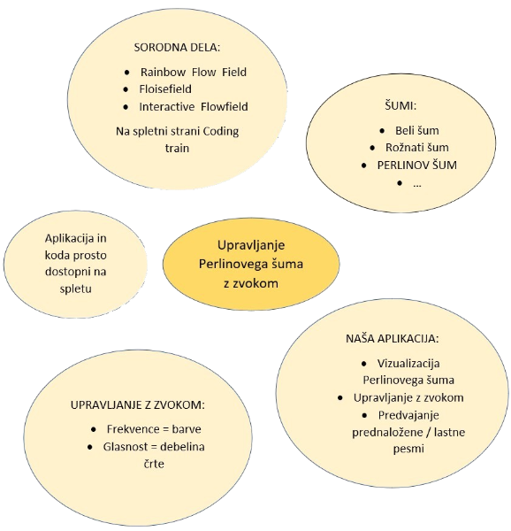

# Upravljanje Perlinovega šuma z zvokom

#### Aljaž Nunčič

##### [aljaz.nuncic@gmail.com](mailto:aljaz.nuncic@gmail.com)

##### Fakulteta za računalništvo in informatiko, Univerza v Ljubljani 
##### Večna pot 113, 1000 Ljubljana, Slovenija

[https://fri.uni-lj.si/](https://fri.uni-lj.si/)

### Povzetek 

V tem delu predstavimo aplikacijo, ki vizualizira Perlinov šum, 
pri tem pa uporabi različne parametre zvoka, ki ga zajamemo z mikrofonom. 
Pri tem smo uporabili frekvenco, ki se prikaže kot barva in glasnost kot debelina črt. 
Aplikacija ima dodano tudi predvajanje skladb, da je ustvarjanje umetnin se zabavnejše. 
Poleg tega vsebuje tudi ostale potrebne funkcionalnosti za upravljanje vizualizacije in njen izvoz.

##### Ključne besede: Perlinov šum · zvok · generativna umetnost.

## 1  Uvod

V članku je predstavljen projekt z istoimenskim naslovom Upravljanje Perlinovega šuma z zvokom. 
Ideja za njegovo implementacijo izvira iz spletnega mesta Coding train [2]. 
Sami smo od tukaj vzeli osnovo za naš projekt, ki pa smo ga nadgradili in dodali upravljanje z zvokom. 
V nadaljevanju sledi opis sorodnih del, širši pregled področja in na koncu opis našega izdelka.

## 2  Sorodna dela

Sorodna dela lahko zasledimo že na sami spletni strani Coding train [2]. 
V nadaljevanju bomo pogledali tiste, ki so zanimivejše in bližje naši aplikaciji. 
Tri, ki so najbližje naši, so predstavljene na sliki 1.

Prva izmed njih je Rainbow Flow Field [9]. 
Aplikacija vizualizira Perlinov šum, pri čemer uporabi več barv. 
To spreminjanje barv je naključno in ne omogoča nobene iteracije z uporabnikom. 
Kot lahko vidimo, se smer risanja šuma (črt) skozi čas ne spreminja. 
Šum se namreč izriše v nekaj sekundah, nato pa so opazne zgolj spremembe barv posameznih črt.

Drug primer je aplikacija Floiseeld [5]. 
Tudi tukaj je avtor uporabil barve, ki se spreminjajo naključno skozi čas. Uporabnik nad samo vizualizacijo nima večjega vpliva, razen pavziranje vizualizacije in prehod v celozaslonski način. 
Sledi točk, ki rišejo sam šum niso stalne in s časom izginjajo.

Tretje sorodno delo je Interactive Floweld [8]. 
Tukaj ima uporabnik nad samo vizualizacijo že več nadzora, a je za to potrebno uporabiti drsnike in iz tega vidika ni najbolj prijazna uporabniku. 
Uporabnik lahko izbira barvo risanja (za to nastavlja količino rdeče, zelene in modre barve v RGB shemi), 
hitrost risanja šuma in natančnost risanja samega Perlinovega šuma.

Slika 1. Vizualizacije treh sorodnih del.

Na spletni strani Coding train lahko zasledimo še nekaj drugih zanimivih projektov, 
ki uporabljajo Perlinov šum. Dve izmed njih sta 3D Simplex Floweld [7], ki za razliko od ostalih vizualizira Perlinov sum v 3D prostoru in ne v 2D, 
kot ostali ter Perlin noise with sine and cos waves [6], ki pri risanju Perlinovega šuma uporabi kotni funkciji sinus in kosinus.

## 3  Šumi

Pri izdelavi aplikacije smo uporabili Perlinov šum, a ta še zdaleč ni edini. 
V naravi namreč poznamo veliko število šumov in nekaj jih bomo predstavili v nadaljevanju.

### 3.1 Beli šum

Verjetno najbolj znan je beli šum [3]. 
Beli šum je naključni signal, ki ima vse frekvence z enako intenziteto. 
Večkrat se uporablja pri elektronski glasbi kot direktni vhod ali pa kot filter za izdelavo ostalih šumov. 
Uporablja se predvsem tudi pri sintezi zvoka udarnih inštrumentov (činele, bobni, ...), ki imajo visoko vsebnost hrupa. 
Njegov tipični primer je neobstoječa radijska postaja. 
Uporablja se tudi v računalništvu kot generator naključnih števil.

### 3.2 Rožnati šum

Rožnati šum je signal s frekvenčnim spektrom, tako da je spektralna gostota moči obratno sorazmerna s frekvenco signala [4]. 
Ta šum je eden najpogostejših v bioloških sistemih. 
Samo ime izhaja iz svetlobe, saj ima rožnata barva enak spekter moči.

### 3.3 Perlinov šum

Da je nek generator naključnih števil dober, med dobljenimi števili ne sme biti nikakršne povezave oziroma more biti ta minimalna [1]. 
To nam velikokrat koristi, ko želimo simulirati naravni pojav. 
A naključnost, kot eno vodilno načelo, ni nujno naravna. 
Obstaja namreč Perlinov šum, ki je algoritem, katerega rezultati so naravnejši. 
Razvil ga je Ken Perlin pri proceduralnih teksturah za računalniško ustvarjene učinke v filmu Tron, za katerega je kasneje prejel tudi Oskarjevo nagrado za tehnične dosežke. 
Uporablja se za ustvarjanje različnih učinkov z naravnimi lastnostmi, kot so oblaki, pokrajine in vzorčne teksture, kot je marmor.

## 4  Naša aplikacija

Pri izdelavi naše aplikacije smo za osnovo vzeli aplikacijo Perlinovega šuma, ki je predstavljena na spletni strani Coding train [2]. 
Tukaj smo dobili implementacijo Perlinovega šuma, ki je enobarven in nima interakcije z uporabnikom, kot lahko vidimo na sliki 2. 
To smo nadgradili in dodali upravljanje šuma s pomočjo različnih lastnosti zajetega zvoka ter nekaj dodatnimi funkcionalnostmi. 
Aplikacija je dostopna na spletnem naslovu https://aljaznuncic.github.io/Perlin-noise, 
sama izvorna koda programa je na https://github.com/aljaznuncic/Perlin-noise, video prikaz pa je na voljo na https://bit.ly/35r8Rn2. 
V nadaljevanju si bomo podrobneje pogledali delovanje naše aplikacije, ki je prikazana na sliki 3.

Slika 2. Vizualizacija Perlinovega šuma s spletne strani Coding train.

Slika 3. Naša aplikacija za upravljanje Perlinovega šuma z zvokom.

Prvi parameter zvoka, ki smo ga uporabili, je frekvenca. 
Odločili smo se, da bomo prikazali le frekvenčni pas, ki prevladuje, za to pa bomo uporabili barve. 
Po zajetju zvoka najprej izračunamo hitro Fourirjevo transformacijo, kjer smo za njegovo velikost (velikost končne tabele, ki jo dobimo) izbrali 1024, 
kar je maksimum, kolikor nam nudi uporabljena knjižnica. 
Na ta način smo frekvence razvrstili v čim manjše intervale, kar nam v nadaljevanju omogoča boljše rezultate. 
Kljub temu, da imamo sedaj 1024 različnih vrednosti, ki jih dobimo s pomočjo Fourirjeve transformacije in na voljo le 256 barv, 
se je izkazalo, da to ni problem. 
Ko smo namreč natančneje pogledali vrednosti v dobljeni tabeli smo opazili, da se pojavljajo frekvence zgolj v začetku tabele. 
Seveda bi lahko dobili vrednosti tudi v preostalem delu, a bi za to potrebovali umetni sintetizator zvoka, 
naša aplikacija pa je namenjena za zvokove, ki jih lahko proizvede človek. 
Prav tako so frekvence v drugem delu tabele zelo moteče pri poslušanju. 
Opazili smo tudi, da se ob govorjenju večinoma vedno pojavljajo nizke frekvence, ki prevladujejo. 
Razlika, ki je bila med govorom z nizkimi in visokimi frekvencami, je bila le v drugem delu grafa, 
ki predstavlja dobljeno vrednost Fourirjeve transformacije v odvisnosti od višine frekvence. 
Če smo govorili z nizkim glasom, je imel graf vrh pri nizkih frekvencah, pri visokih pa so bile vrednosti zelo nizke. 
V primeru, ko pa smo govorili z visokim glasom, je bil vrh še vedno velikokrat pri nizkih frekvencah, 
pri visokih frekvencah pa so bile vrednosti malce nižje. 
Ta problem smo v nadaljevanju rešili tako, da smo z poskušanjem izbrali vrednost glajenja grafa. 
Na podlagi vseh testiranj smo tako izboljšali prikazovanje prevladujoče frekvence v zvoku s pomočjo barv.

Drug parameter zvoka, s katerim krmilimo našo aplikacijo je glasnost zvoka. 
Tudi tukaj zajamemo zvok preko mikrofona. 
Glasnost se na vizualizaciji vidi kot trenutna debelina črt, ki se uporabi za risanje Perlinovega šuma. 
Sama funkcija, ki nam vrače glasnost zvoka, nam vrača vrednosti med 0 in 1, kje je slednja maksimalna glasnost. 
S pomocjo testiranja smo nato določili tudi maksimalno debelino črte ob maksimalni glasnosti, 
da le-ta ni predebela in bi hitro zapolnila prostor.

Ker je ustvarjanje umetnosti ob glasbi zabavnejše, smo v našo aplikacijo dodali tudi predvajanje le-te. 
Tako lahko poleg glasbene podlage pojemo tudi sami in s tem ustvarimo umetnini po našem glasbenem okusu. 
Aplikacija že vsebuje nekaj predhodno naloženih skladb različnih žanrov, ki se naložijo asinhrono, 
kar omogoča takojšen zagon aplikacije, skladbe pa se dodajajo v nadaljevanju. 
To je zelo uporabno predvsem, ko uporabljamo manj zmogljiv strežnik za gostovanje spletne strani. 
Seveda pa naša aplikacija omogoča dodajanje tudi skladb samega uporabnika.

Tukaj so tudi različne funkcionalnosti, ki so povezane z upravljanjem same vizualizacije, 
kot je sprememba ozadja vizualizacije, ponastavitev in pavziranje vizualizacije in izvoz končnega izdelka. 
Prav tako je dobro poudariti, da se število točk, ki riše Perlinov šum izračuna glede na velikost prostora za vizualizacijo in je tako aplikacija prilagojena tako za manjše, 
kot večje zaslone.

Primer vizualizacije z govorom je prikazan na sliki 4, medtem ko je primer vizualizacij posameznih pesmi na sliki 5.

Slika 4. Primer vizualizacije ob govorjenju.

Slika 5. Primer vizualizacije za pesmi Sixteen tons, Cvet z juga in Hard rock hallelujah.

## 5  Zaključek in diskusija

Obstaja veliko šumov in poleg najbolj znanega belega šuma je zanimiv tudi Perlinov šum. 
Uporablja se za ustvarjanje različnih učinkov z naravnimi lastnostmi, kot so oblaki, pokrajine in vzorčne teksture, kot je marmor. 
Sami smo ga uporabili v svoji aplikaciji, kjer lahko uporabnik s pomočjo zvoka, ki ga naprava zajame izdela svojo lastno umetniško sliko. 
Od zvočnih parametrov smo uporabili glasnost zvoka in frekvenco, s katero smo imeli kar nekaj težav, 
saj so skoraj v vseh zvokih vedno prisotne nizke frekvence, a smo ta problem s posameznimi obdelavami rezultatov hitre Fourirjeve transformacije zmanjšali s pomočjo testiranja. 
Za zabavo uporabnika smo dodali tudi možnost predvajanja posameznih skladb, kar da naši aplikaciji tudi zabavni del ob ustvarjanju umetnosti.

V prihodnosti bi lahko dodali še katero dodatno upravljanje Perlinovega šuma s katerim drugim parametrom zvoka, 
a žal v p5 nismo našli možnosti za zajem še katerega zanimivega parametra zvoka. 
Druga možnost pa je, da bi poleg zvoka uporabili še kaj drugega, a pri tem ostaja želja, 
da je le-to dostopno velikemu številu uporabnikov, saj je aplikacija prosto dostopna na spletu.

## 6  Miselni vzorec

## Literatura

1. Perlin noise (article) | noise, https://www.khanacademy.org/computing/computer-programming/programming-natural-simulations/programming-noise/a/perlin-noise, Dostopano: 6.01.2021
2. Coding train - coding challenge 24 : Perlin noise ow eld (Jun 2016), https://thecodingtrain.com/CodingChallenges/024-perlinnoiseflowfield.html, Dostopano: 18.11.2020
2. White noise (Nov 2020), https://en.wikipedia.org/wiki/White_noise, Dostopano: 6.01.2021
2. Pink noise (Jan 2021), https://en.wikipedia.org/wiki/Pink_noise, Dostopano: 6.01.2021
2. Aerore: Floiseeld, https://afferore43.github.io/flowfield/, Dostopano: 5.01.2021
2. Borrus-sudo: Perlin noise with sine and cos waves, https://editor.p5js.org/DeathChargRocks21/sketches/SjYAyzrr6, Dostopano: 5.01.2021
2. Karrer, J.: 3d simplex oweld, https://studioerika.de/julian/project/flow, Dostopano: 5.01.2021
2. R, N.: Interactive oweld, https://nilsde.github.io/flowfield/, Dostopano: 5.01.2021
2. Ribeiro, F.: Rainbowoweld, https://github.com/fernand0aguilar/p5-plus-plus/tree/master/3.Projects/06.RainbowFlowField, Dostopano: 5.01.2021
